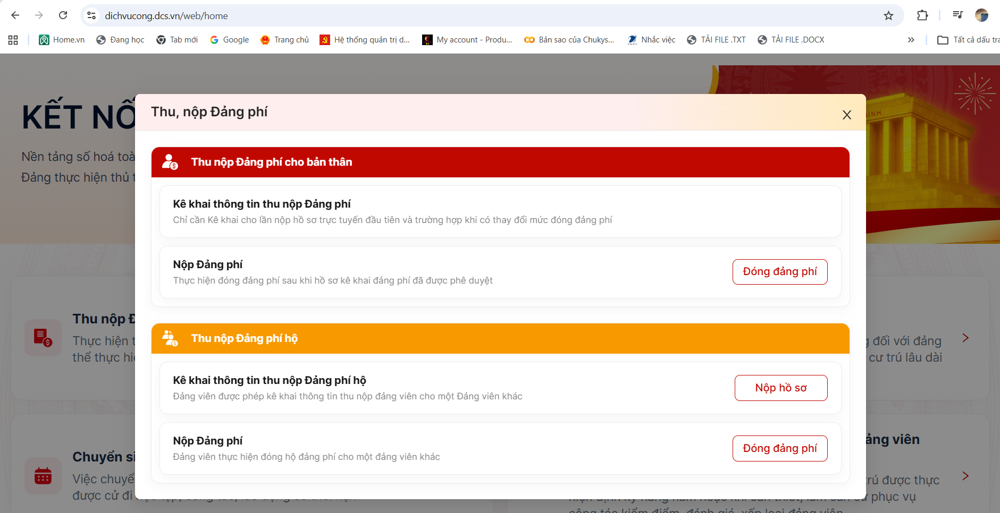

# HƯỚNG DẪN KÊ KHAI ĐẢNG PHÍ CHO BẢN THÂN

## 1. GIỚI THIỆU

Kê khai thông tin đảng phí cho bản thân là bước nghiệp vụ giúp đảng viên cung cấp, kiểm tra và xác nhận các thông tin cần thiết trước khi thực hiện nộp đảng phí trên môi trường điện tử.

Chức năng này được thực hiện trên ứng dụng iCPV - TTHC thuộc Hệ thống thông tin giải quyết thủ tục hành chính của Đảng.

Trang hướng dẫn giúp đảng viên thực hiện các thao tác kê khai thông tin đảng phí cá nhân theo trình tự, hạn chế sai sót và thuận tiện trong quá trình sử dụng hệ thống.

---

## 2. CHUẨN BỊ TRƯỚC KHI KÊ KHAI

Trước khi thực hiện, đảng viên cần chuẩn bị:

| STT | Nội dung | Yêu cầu |
|:---:|---|---|
| 1 | Điện thoại thông minh | Có kết nối Internet |
| 2 | Ứng dụng iCPV - TTHC | Đã cài đặt và đăng nhập thành công |
| 3 | Tài khoản VNeID | Sử dụng để xác thực đăng nhập |
| 4 | Thông tin cá nhân | Bảo đảm chính xác, thống nhất |
| 5 | Thông tin sinh hoạt Đảng | Phục vụ kiểm tra thông tin kê khai |
| 6 | Thông tin đảng phí | Theo yêu cầu kê khai của hệ thống |

> **Lưu ý:** Đảng viên cần kiểm tra kỹ thông tin cá nhân và thông tin sinh hoạt Đảng trước khi gửi hồ sơ kê khai.

---

## 3. QUY TRÌNH KÊ KHAI ĐẢNG PHÍ CHO BẢN THÂN

Quy trình thực hiện được khái quát qua 5 bước:

**Bước 1:** Đăng nhập ứng dụng iCPV - TTHC.

**Bước 2:** Truy cập chức năng thu, nộp đảng phí.

**Bước 3:** Lựa chọn kê khai đảng phí cho bản thân.

**Bước 4:** Kiểm tra và hoàn thiện thông tin kê khai.

**Bước 5:** Gửi hồ sơ và theo dõi kết quả xác nhận.

---

## 4. HƯỚNG DẪN THỰC HIỆN CHI TIẾT

### Bước 1. Đăng nhập ứng dụng

Mở ứng dụng iCPV - TTHC trên điện thoại.

Thực hiện đăng nhập bằng tài khoản định danh điện tử VNeID theo hướng dẫn của hệ thống.

Sau khi đăng nhập thành công, người sử dụng được chuyển đến giao diện chính của ứng dụng.

> Nếu chưa cài đặt hoặc chưa đăng nhập được, xem hướng dẫn tại trang [Cài đặt và đăng nhập iCPV - TTHC](dang-nhap.md).

### Bước 2. Truy cập chức năng thu, nộp đảng phí

Tại giao diện chính, tìm và lựa chọn chức năng liên quan đến thu, nộp đảng phí.

Hệ thống hiển thị các chức năng nghiệp vụ để đảng viên lựa chọn.

### Bước 3. Lựa chọn kê khai cho bản thân

Chọn chức năng kê khai thông tin đảng phí cho bản thân.

Đảng viên thực hiện kê khai bằng tài khoản cá nhân đã đăng nhập.

> **Lưu ý:** Cần phân biệt chức năng kê khai cho bản thân với chức năng kê khai hộ đảng viên khác.

### Bước 4. Kiểm tra và hoàn thiện thông tin

Tại giao diện kê khai, đảng viên kiểm tra các thông tin được hệ thống hiển thị và bổ sung nội dung theo yêu cầu.

Các nhóm thông tin cần chú ý gồm:

| STT | Nhóm thông tin | Nội dung kiểm tra |
|:---:|---|---|
| 1 | Thông tin cá nhân | Kiểm tra thông tin định danh của bản thân |
| 2 | Thông tin tổ chức Đảng | Kiểm tra thông tin chi bộ, tổ chức Đảng |
| 3 | Thông tin kê khai đảng phí | Thực hiện theo các trường thông tin hệ thống yêu cầu |
| 4 | Thông tin bổ sung | Hoàn thiện nếu hệ thống yêu cầu |

Đảng viên cần đọc kỹ các trường thông tin trước khi xác nhận.

Trường hợp phát hiện thông tin chưa chính xác, cần thực hiện điều chỉnh theo chức năng được hệ thống cung cấp hoặc liên hệ cán bộ phụ trách để được hướng dẫn.

### Bước 5. Gửi hồ sơ kê khai

Sau khi kiểm tra và hoàn thiện thông tin, đảng viên thực hiện thao tác gửi hồ sơ kê khai theo hướng dẫn hiển thị trên ứng dụng.

Kiểm tra thông báo hoặc trạng thái xử lý của hồ sơ sau khi gửi.

Nếu hồ sơ cần bổ sung hoặc điều chỉnh, thực hiện theo yêu cầu được hệ thống thông báo.

---

## 5. THEO DÕI KẾT QUẢ KÊ KHAI

Sau khi gửi hồ sơ, đảng viên cần theo dõi kết quả xử lý và xác nhận thông tin.

| Tình huống | Hướng xử lý |
|---|---|
| Hồ sơ đang được xử lý | Theo dõi trạng thái trên hệ thống |
| Hồ sơ cần bổ sung | Kiểm tra yêu cầu và hoàn thiện thông tin |
| Thông tin chưa chính xác | Liên hệ bộ phận phụ trách để được hướng dẫn |
| Hồ sơ đã được xác nhận | Tiếp tục thực hiện nghiệp vụ nộp đảng phí |

> **Quan trọng:** Hoàn thành kê khai thông tin không đồng nghĩa với việc đã nộp đảng phí. Đảng viên cần thực hiện bước thanh toán riêng theo quy trình của hệ thống.

---

## 6. NHỮNG LƯU Ý KHI KÊ KHAI

- Sử dụng tài khoản định danh điện tử của bản thân.
- Kiểm tra thông tin cá nhân và tổ chức Đảng trước khi gửi.
- Không tự ý kê khai thông tin không đúng thực tế.
- Theo dõi trạng thái hồ sơ sau khi gửi.
- Không chia sẻ mật khẩu hoặc mã OTP cho người khác.
- Khi có vướng mắc, liên hệ cán bộ phụ trách công tác đảng phí tại chi bộ để được hỗ trợ.

---

## 7. CÂU HỎI THƯỜNG GẶP

### Câu hỏi 1. Kê khai thông tin đảng phí có phải là đã nộp đảng phí không?

Không. Kê khai thông tin và thanh toán đảng phí là hai bước nghiệp vụ khác nhau.

Đảng viên cần thực hiện thanh toán và kiểm tra kết quả giao dịch để xác định việc nộp đảng phí đã hoàn thành.

### Câu hỏi 2. Nếu thông tin kê khai chưa chính xác thì phải làm gì?

Đảng viên cần kiểm tra lại thông tin, thực hiện điều chỉnh theo hướng dẫn của hệ thống hoặc liên hệ cán bộ phụ trách để được hỗ trợ.

### Câu hỏi 3. Có thể sử dụng tài khoản của người khác để kê khai cho bản thân không?

Đảng viên cần sử dụng tài khoản cá nhân để thực hiện kê khai cho bản thân.

Trường hợp thực hiện kê khai hộ phải sử dụng chức năng kê khai hộ theo quy trình được hướng dẫn.

### Câu hỏi 4. Sau khi gửi hồ sơ kê khai cần làm gì?

Đảng viên theo dõi trạng thái xử lý hồ sơ, thực hiện bổ sung nếu được yêu cầu và tiếp tục nghiệp vụ nộp đảng phí khi đủ điều kiện.

---

## 8. HƯỚNG DẪN TIẾP THEO

Sau khi hoàn thành kê khai thông tin cho bản thân, đảng viên có thể tiếp tục tham khảo:

- [Cài đặt và đăng nhập iCPV - TTHC](dang-nhap.md)
- [Kê khai hộ đảng viên khác](ke-khai-ho.md)
- [Hướng dẫn nộp đảng phí điện tử](nop-dang-phi.md)
- [Lịch sử nộp đảng phí](lich-su-nop.md)

---

## 9. NGUỒN TÀI LIỆU

Nội dung được biên soạn phục vụ đồ án trên cơ sở tài liệu hướng dẫn sử dụng hệ thống nộp hồ sơ thủ tục hành chính của Đảng trên môi trường điện tử.

Hệ thống thông tin giải quyết thủ tục hành chính của Đảng:

[https://dichvucong.dcs.vn](https://dichvucong.dcs.vn)

---

**CẨM NANG NỘP ĐẢNG PHÍ ĐIỆN TỬ**

**Sinh viên thực hiện:** Lô Thị Thái.

**Đơn vị công tác:** Văn phòng Đảng ủy xã Na Ngoi, tỉnh Nghệ An.

*Tài liệu phục vụ đồ án học phần Nhập môn Công nghệ thông tin.*
